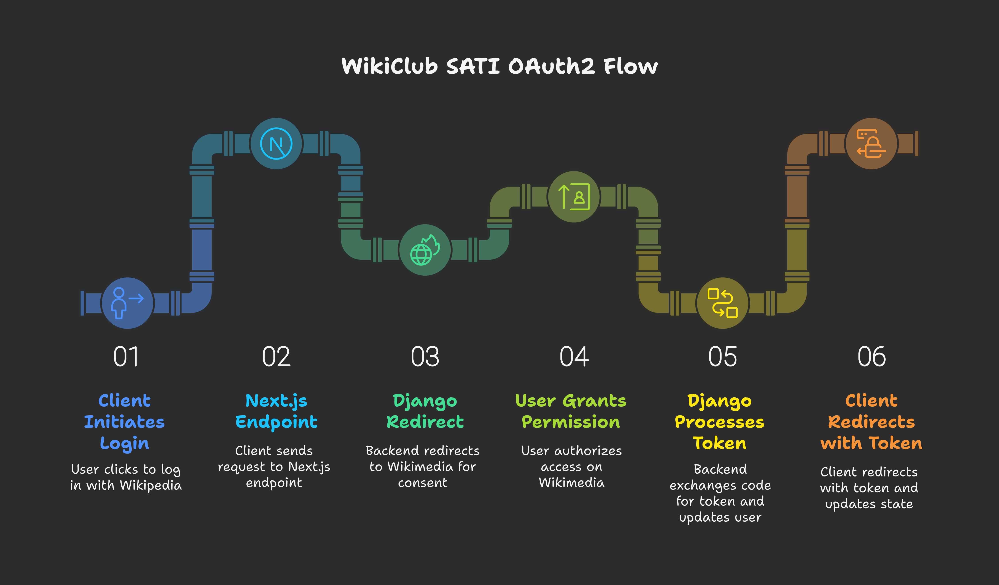

# WikiClub SATI

**An open-source, student-led platform aligned with the Wikimedia mission of free knowledge for everyone.**

WikiClub SATI empowers SATI students and community contributors to log in with their existing Wikipedia credentials, track and visualize their Wikimedia contributions, and collaborate on campaigns and events—all in a secure, modern, deployment-ready web application.

**Live Demo:**  
- Frontend: https://wikiclub.in  
- Backend:  https://wikiclub.onrender.com  

**Source Code:**  
- Frontend: https://github.com/wikisati/wikiclub-frontend  
- Backend:  https://github.com/wikisati/wikiclub-backend  

---

## Features

- **Wikimedia OAuth 2.0 Authentication**  
  Secure “Login with Wikipedia” flow using MediaWiki’s OAuth2 endpoints.  
- **User Dashboard**  
  Real-time visualization of edits, article creations, and other contribution statistics.  
- **Campaign & Event Collaboration**  
  Discover and join upcoming editathons, workshops, and community drives.  
- **Responsive, Accessible UI**  
  Built with Tailwind CSS and Shadcn UI for utility-first, accessible design.  
- **Lightweight State Management**  
  Global store via Zustand, hydrated from session/local storage.  
- **RESTful API Layer**  
  Powered by Django REST Framework, with secure token and session handling.  
- **CI/CD Pipelines**  
  GitHub → Vercel (frontend) and GitHub → Render (backend) for zero-touch deployments.  

---

## Technology Stack

| Layer         | Technology                             |
|---------------|----------------------------------------|
| **Frontend**  | Next.js 15 + React 19                  |
|               | Tailwind CSS + Shadcn UI               |
|               | Zustand                                |
|               | Axios                                  |
| **Backend**   | Django 5.2.1 + DRF                     |
|               | PostgreSQL                             |
|               | Gunicorn                               |
| **Auth & DB** | MediaWiki OAuth 2.0                    |
|               | JWT (HTTP-only cookies)               |
| **Hosting**   | Vercel (frontend)                      |
|               | Render (backend + Postgres service)    |

---

## Architecture & Flow

1. **Client** clicks “Login with Wikipedia” → `/api/auth/init` (Next.js → Django)  
2. **Django** redirects to Wikimedia OAuth screen  
3. User **grants permission** → Wikimedia redirects to `/api/auth/callback`  
4. **Django** exchanges code for access token, fetches profile, stores/updates user  
5. Redirect back to **Next.js** with token & username  
6. **Zustand** hydrates state; dashboard fetches contribution stats via `/api/me`

---

## Deployment

### Backend (Render)

- **Build Command:** `pip install -r requirements.txt`  
- **Start Command:** `gunicorn wikiclub.wsgi:application`  

### Frontend (Vercel)

- **Framework Preset:** Next.js  
- **Automatic Deploys:** Enabled on every Git push  

---

## API Endpoints

| Method | Path                  | Description                              |
|--------|-----------------------|------------------------------------------|
| GET    | `/api/auth/init`      | Start Wikimedia OAuth2 login             |
| GET    | `/api/auth/callback`  | Handle OAuth2 callback & token exchange  |
| GET    | `/api/me`             | Fetch authenticated user profile & stats |
| POST   | `/api/logout`         | Clear session and tokens                 |
| POST   | `/api/token/refresh`  | Rotate/refresh access token              |

---

## Security Practices

- **HTTP-only, Secure Cookies** for JWT storage  
- **SameSite=None** to support cross-site OAuth flows  
- **CSRF Protection** enabled in Django and Next.js  
- **CORS** restricted to production domains only  
- **Secrets** managed via environment variables (never committed)  
- **Token Rotation** for long-lived sessions  

---

## Future Roadmap

- **`/api/me` enhancements:** More granular stats, server-side caching  
- **Heatmap visualization** of edit activity over time  
- **Campaign/Event creation** and management module  
- **OAuth2.1 with PKCE** and refresh token rotation  
- **Community Analytics Dashboard:** Aggregate metrics, leaderboards  

---

## License

This project is open-source and available under the [MIT License](LICENSE).

---

**Author:**  
Dev Jadiya  
India  
